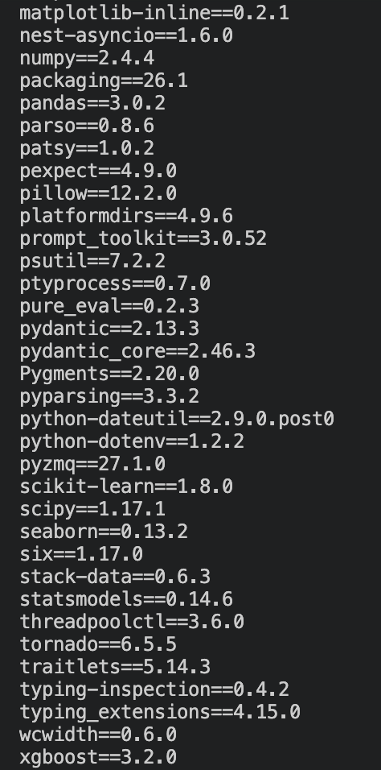

# AIT736-Team3
This is the repo for final project in Applied Machine Learning course Spring 2026

* Problem statement: This project aims at building different machine learning models to predict customer churn at Telco company by analyzing customer related factors.

* Business goal: The primary goal is to maximize churn detection (recall) while minimizing the number of missed churner, enabling the company to proactively retain customers. 

* Dataset
    - Name: Telco Customer Churn 
    - Format: csv
    - Data source: Kaggle
    - Target variable: Churn (Yes/No)

##### 🧠 --- Machine Learning pipeline --- 

* 1: Project setup
```
    mkdir -p \
    data \
    notebooks \
    slides \
    recording \
```

* 2. Environment Setup

* Create requirements.txt file
```
    cat > requirements.txt << 'EOF'
    pandas
    numpy
    scikit-learn
    pydantic
    python-dotenv
    matplotlib
    seaborn
    statsmodels
    xgboost
    EOF
```
* Create virtual environment
```
python3.11 -m venv .venv
source .venv/bin/activate
pip install --upgrade pip
uv pip install -r requirements.txt
```
* 'uv' package automatically select the proper version of each Python library, ensuring no depency issue
    * 

* 3. Data processing and EDA
    - Data cleansing and preprocessing
    - Handling missing values and encoding categorical variables
    - Exploratory Data Analysis (EDA) to understand churn distribution
    - Feature transformation for model readiness

* 4. Model Development
    - We constructed Random Forest and XGBoost Classifier (final model)
    - Techniques used:
        * Stratified K-Fold Cross Validation
        * Hyperparameter tuning
        * Class imbalance handling using scale-pos-weight
        * Threshold tuning for optimal classification

* 5. Model Evaluation
    - Models were evaluated using:
        * Accuracy
        * Precision
        * Recall (Primary metric)
        * F1-score
        * ROC-AUC
        * ROC Curve

* 6. Final Model Conclusion
    - The final XGBoost Classifier model was selected based on cross-validated performance and threshold tuning. The optimal configuration is:
        * n_estimators:500,
        * learning_rate: 0.01,
        * max_depth: 3,
        * subsample: 0.8,
        * cosample: 0.8,
        * decision threshold: 0.5

    - This configuration achives strong balance between predictive performance and generalization. The relatively shallow tree depth (max_depth=3) combined with low learning rate (0.01) and high number of estimators (500) allow the model to learn complex patterns slowly while minimizing the risk of overfitting. 


